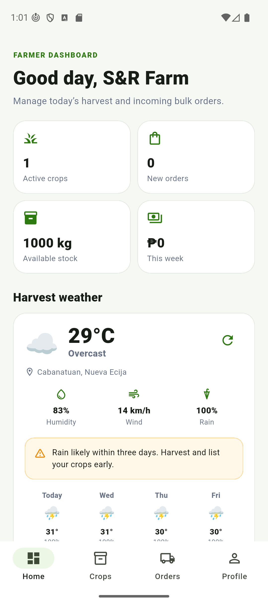

# AgriLink — API Integration (Week 5)

**Project:** AgriLink Mobile (Flutter) · **Feature:** Live weather for harvest planning and delivery safety

---

## 1. API Name

**Open-Meteo** — a free, open-source weather API (https://open-meteo.com).

Chosen because it requires **no API key and no account**, so no secret is
committed to the repository and the project runs straight from source. It is
free for non-commercial use and provides a geocoding endpoint on the same
service, so town search and forecasts come from one provider. Attribution is
displayed in the app as *"Weather data by Open-Meteo.com"*.

## 2. API Endpoints Used

**2.1 Forecast** — `GET https://api.open-meteo.com/v1/forecast`

```
?latitude=15.4865&longitude=120.9734
&current=temperature_2m,relative_humidity_2m,apparent_temperature,precipitation,weather_code,wind_speed_10m
&daily=weather_code,temperature_2m_max,temperature_2m_min,precipitation_probability_max,precipitation_sum
&timezone=auto&forecast_days=7
```

**2.2 Geocoding (town search)** — `GET https://geocoding-api.open-meteo.com/v1/search`

```
?name=Cabanatuan&count=8&language=en&format=json
```

## 3. Sample JSON Response

Actual forecast response (Cabanatuan, 10 August 2026), abbreviated to three days:

```json
{
  "latitude": 15.500878, "longitude": 120.95864,
  "timezone": "Asia/Manila", "elevation": 33.0,
  "current": {
    "time": "2026-08-10T23:30", "temperature_2m": 25.2,
    "relative_humidity_2m": 95, "apparent_temperature": 29.2,
    "precipitation": 0.00, "weather_code": 3, "wind_speed_10m": 15.2
  },
  "daily": {
    "time": ["2026-08-10", "2026-08-11", "2026-08-12"],
    "weather_code": [95, 95, 95],
    "temperature_2m_max": [28.9, 30.6, 29.6],
    "temperature_2m_min": [24.3, 24.7, 24.8],
    "precipitation_probability_max": [100, 100, 100],
    "precipitation_sum": [14.20, 10.70, 17.60]
  }
}
```

Actual geocoding response, abbreviated:

```json
{ "results": [ {
    "id": 1721906, "name": "Cabanatuan City",
    "latitude": 15.48586, "longitude": 120.96648,
    "country": "Philippines", "admin1": "Central Luzon",
    "population": 343672
} ] }
```

Note that `daily` is **column-oriented**: every field is a parallel array, and
index *i* of each array describes the same day.

## 4. Explanation of the Integration

**Files added:** `services/weather_service.dart` (HTTP + error mapping),
`models/weather.dart` (JSON parsing + advisory logic),
`widgets/weather_card.dart` (dashboard card), `screens/weather_screens.dart`
(7-day page + search), `test/weather_service_test.dart` (13 tests).

**Data flow:**

```
Coordinates pinned at signup (mobileUsers, Firestore)
  → WeatherService.loadForecast()  --HTTP GET-->  api.open-meteo.com
  → jsonDecode() → FarmWeather.fromJson()  (typed Dart objects)
  → WeatherPanel (auto-refresh 10 min + pull-to-refresh)
  → WeatherCard on the Farmer and Rider dashboards
```

**The coordinates are not hardcoded.** They come from the location the user
pinned on the map during registration, already stored in the `mobileUsers`
collection — so a farmer sees the weather over *their own farm*. This is what
makes it an integration rather than a bolt-on widget.

**HTTP GET.** One shared request path builds the URL with
`Uri.https(host, path, queryParameters)` for correct encoding, then
`await _client.get(uri).timeout(Duration(seconds: 12))` so a dead network cannot
hang the UI.

**JSON processing.** Raw JSON never reaches the UI. `FarmWeather.fromJson()`
reads the `current` object and walks the column-oriented `daily` arrays by
index. Defensive `_toDouble` / `_toInt` helpers coerce values, and
`WeatherCondition.fromCode()` maps the numeric **WMO weather code** to a label
and emoji (`95` → "Thunderstorm ⛈️").

**UI display.** Data appears on the Farmer dashboard ("Harvest weather"), the
Rider dashboard ("Delivery conditions"), and a full 7-day outlook page with
town search. Values are *interpreted*, not just printed — the same reading
produces different guidance per role:

| Condition | Farmer sees | Rider sees |
| --- | --- | --- |
| Thunderstorm | "Hold off on harvesting and secure your stored produce." | "Avoid accepting trips until this passes." |
| Rain ≥60% in 3 days | "Harvest and list your crops early." | "Bring a tarpaulin for the pooled orders." |
| Clear, <34 °C | "Good harvest window." | "Clear roads. Good conditions for pooled deliveries." |

**Error handling.** Every failure becomes an actionable message with a retry
button, and the card degrades alone so the dashboard keeps working:

| Failure | Detection | Message |
| --- | --- | --- |
| No internet | `SocketException` | "No internet connection. Check your network and try again." |
| Connection dropped | `ClientException` | "Could not reach the weather service." |
| Too slow | `TimeoutException` (12 s) | "The weather service took too long to respond." |
| Rate limited | HTTP 429 | "Too many weather requests right now." |
| API down | HTTP 5xx | "The weather service is temporarily unavailable." |
| Not JSON (HTML error page) | `FormatException` | "The weather service returned an invalid response." |
| Missing expected keys | null check | "The weather service returned an unexpected response." |

**Bonus implemented:** multiple endpoints (forecast + geocoding); search with a
450 ms debounce so one lookup fires per pause in typing; dynamic refresh
without a page reload (10-minute timer, refresh button, and pull-to-refresh,
all via `setState`). A 5-minute cache keyed by coordinates prevents redundant
calls; the refresh button clears it so refresh always means a real request.
POST was not implemented because Open-Meteo is read-only and exposes no POST
endpoint.

### A second public API: OSRM routing

The project also calls **OSRM** (`https://router.project-osrm.org/route/v1/driving/...`),
a free routing API that needs no key. It returns a driving route as GeoJSON:

```json
{ "routes": [ {
    "distance": 102344.7, "duration": 6019.2,
    "geometry": { "coordinates": [[120.9414, 15.0794], ...] }
} ] }
```

`distance` (metres) and `duration` (seconds) are parsed into a `RoutePath`, and
`geometry.coordinates` is drawn as the rider's route line on the map. This was
already powering the active-trip map; this week it was extended to the **Order
Pool**, which previously showed a straight-line estimate. Riders now see the
real road distance and ETA before accepting a route — screenshot 6.

Routes are fetched one at a time and only for the batches on screen, and are
cached by waypoint list, because this runs against the public OSRM demo server
and the pool reloads every few seconds.

**Database impact:** no new collection. The feature *reads* the existing
`latitude` / `longitude` fields in the `profile` map of `mobileUsers`, captured
when the user pinned their location at registration. Forecasts are not
persisted, because cached weather goes stale faster than it is useful.

**Testing:** 13 tests over both endpoints, the WMO mapping, every error path,
the debounce guard, and cache behaviour, using a mocked HTTP client so they run
without a network. Project total: 52 of 52 passing; `flutter analyze` clean.

## 5. Screenshots

All captured on a Pixel 9 emulator (Android 16) against the live API.

| # | File | Shows |
| --- | --- | --- |
| 1 | `screenshots/01-farmer-harvest-weather.png` | **API request working + data displayed** — Farmer Dashboard "Harvest weather" with live values (25 °C, Overcast, 94% humidity, 100% rain) and the harvest advisory |
| 2 | `screenshots/02-rider-delivery-conditions.png` | **Same reading, different role** — Rider Dashboard showing the delivery advisory ("Bring a tarpaulin") instead of the harvest one |
| 3 | `screenshots/03-seven-day-outlook.png` | **Full outlook** — 7-day table with per-day condition, rain chance, rainfall in mm, and high/low |
| 4 | `screenshots/04-town-search-geocoding.png` | **Second endpoint** — geocoding search for "Baguio" returning 8 matches |
| 5 | `screenshots/05-offline-error-handling.png` | **Error handling** — the app with Wi-Fi and mobile data off, showing a clear message and a retry action instead of hanging |
| 6 | `screenshots/06-rider-pool-osrm-routing.png` | **Second API** — the Order Pool showing real driving distance and ETA (102 km • 1h 40m) from OSRM |
| 7 | `screenshots/07-four-wheel-vehicle-only.png` | Rider signup restricted to four-wheel vehicles |



## 6. Reflection

Integrating the Open-Meteo API turned AgriLink from a system that only records
transactions into one that helps users decide *when* to act — a farmer can see
that a 100% chance of rain is coming and harvest early rather than lose a crop,
and a rider can see that a thunderstorm makes a pooled route unsafe before
accepting it. The main challenge was that Open-Meteo returns its daily forecast
in a column-oriented format, where each field is a separate parallel array
instead of a list of day objects, so the parser had to walk the arrays by index
and defend against fields of differing lengths. A second challenge was error
handling: a weather widget must never take down the dashboard, so every failure
— no connection, timeout, rate limit, or an HTML error page arriving where JSON
was expected — had to be caught individually and turned into a clear message
with a retry option. The most valuable lesson was that displaying raw API data
is not the same as integrating it; mapping the numeric WMO weather codes into
role-specific advice for farmers and riders is what actually made the data
useful inside our system.
