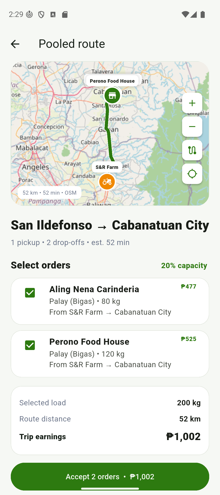

# AgriLink — API Integration (Week 5)

**Project:** AgriLink Mobile (Flutter) · **Focus:** OpenStreetMap routing and geocoding for pooled farm deliveries

---

## 0. Requirements Checklist

| Requirement | Where it is met |
| --- | --- |
| Integrate at least one public API | Four: OSRM routing, Nominatim geocoding, OSM tiles, Open-Meteo weather — §1, §7 |
| Implement an HTTP GET request | `RouteService.route()` in `lib/services/geo.dart` — §4.3 |
| Retrieve and process JSON data | `RoutePath` parsing, incl. the `[lon,lat]` → `[lat,lng]` flip — §4.4 |
| Display API data in the UI | Pooled route map, Order Pool cards, location picker — §4.5, screenshots 1–3 |
| Handle basic errors | Nine named failure modes, all tested — §4.6, §8 |
| Explain how the API improves the project | §4.2 and the Reflection in §9 |

---

## 1. API Name

**OpenStreetMap (OSM)** and its open service ecosystem. Three OSM-based
services are integrated, none of which requires an API key or an account:

| Service | What it provides |
| --- | --- |
| **OSRM** (`router.project-osrm.org`) | Driving routes, distance, and ETA |
| **Nominatim** (`nominatim.openstreetmap.org`) | Reverse geocoding — coordinates → address |
| **OSM tile server** (`tile.openstreetmap.org`) | The map imagery itself |

OSM was chosen because AgriLink is a **logistics** platform: its core problem is
getting bulk farm produce to buyers, and that is a routing problem. Commercial
alternatives such as Google Maps require a billing-enabled API key, while the
OSM stack is free, open-licensed, and needs no secret in the repository.

Attribution is displayed in-app: the route badge reads "OSM", and Nominatim
results carry OpenStreetMap's ODbL licence notice.

A fourth public API, **Open-Meteo**, is also integrated for weather; it is
described in section 7.

## 2. API Endpoints Used

**2.1 OSRM routing** — the main integration

```
GET https://router.project-osrm.org/route/v1/driving/{lon,lat};{lon,lat};...
    ?overview=full&geometries=geojson
```

Coordinates are `longitude,latitude` (the reverse of most APIs) and are joined
with `;` — one waypoint per stop on the trip. `overview=full` returns the full
road geometry so the route can be drawn, not just measured.

Real example (S&R Farm → Cabanatuan):

```
https://router.project-osrm.org/route/v1/driving/120.9414,15.0794;120.9673,15.4864?overview=full&geometries=geojson
```

**2.2 Nominatim reverse geocoding**

```
GET https://nominatim.openstreetmap.org/reverse?format=jsonv2&lat=15.4864&lon=120.9673&zoom=18
```

**2.3 OSM tiles**

```
GET https://tile.openstreetmap.org/{z}/{x}/{y}.png
```

## 3. Sample JSON Responses

### 3.1 OSRM (actual response, abbreviated)

```json
{
  "code": "Ok",
  "routes": [{
    "distance": 49426,
    "duration": 2893.8,
    "weight_name": "routability",
    "geometry": { "coordinates": [[120.941396, 15.079411], [120.9415, 15.0801], ...] },
    "legs": [{ "distance": 49426, "duration": 2893.8, "steps": [] }]
  }],
  "waypoints": [
    { "location": [120.941396, 15.079411], "name": "", "distance": 1.29 },
    { "location": [120.967269, 15.486488], "name": "General Tinio Street", "distance": 10.29 }
  ]
}
```

`distance` is in **metres** and `duration` in **seconds** — both are converted
before display. `geometry.coordinates` is a `[lon, lat]` list that is flipped
into `[lat, lng]` for the map polyline.

### 3.2 Nominatim (actual response, abbreviated)

```json
{
  "place_id": 260992805,
  "licence": "Data © OpenStreetMap contributors, ODbL 1.0. http://osm.org/copyright",
  "osm_type": "node",
  "lat": "15.4863517", "lon": "120.9672227",
  "display_name": "General Tinio Street, Maria Teresa, Isla, Cabanatuan, Nueva Ecija, Central Luzon, 3100, Philippines",
  "address": {
    "road": "General Tinio Street", "village": "Isla",
    "city": "Cabanatuan", "state": "Nueva Ecija",
    "postcode": "3100", "country": "Philippines", "country_code": "ph"
  }
}
```

## 4. Explanation of the Integration

### 4.1 Where the data goes

```
Farm + buyer coordinates (mobileOrders, Firestore)
  → RouteService.route(stops)  --HTTP GET-->  router.project-osrm.org
  → jsonDecode() → RoutePath { points, distanceKm, duration }
  → drawn as a polyline on OSM tiles + shown as "52 km • 52 min"
```

**Files:** `lib/services/geo.dart` (`RouteService`, `RoutePath`),
`lib/widgets/live_map.dart` (map + polyline), `lib/screens/rider_screens.dart`
(Order Pool), `lib/screens/auth_screens.dart` (`LocationPickerPage`, Nominatim).

### 4.2 How the API improves the project

Before this integration, AgriLink measured a delivery as a **straight line**
between the farm and the buyer. On provincial roads that understates the real
trip badly — the route in screenshot 1 is **52 km of road against roughly 45 km
of straight line**, and that 7 km gap is the rider's unpaid fuel and time.

Concretely, the routing API gives the platform three things it could not
compute on its own:

1. **A distance a rider can trust** before accepting a pooled route, instead of
   a figure that is always optimistic.
2. **An ETA** (52 min), so a buyer can be told when produce actually arrives.
3. **A drawn route** on the map, so the rider can see the roads the trip
   follows rather than a line through rice fields.


### 4.2b What this week added

OSRM already powered the rider's active-trip map. This week it was extended to
the **Open Order Pool**, which had been showing a straight-line estimate — the
worst place for a guess, because that is the screen where a rider decides
whether a route is worth accepting. Pool cards now show the real driving
distance and ETA (screenshot 2), and the figure matches the Pooled route screen
exactly (screenshot 1).

### 4.3 HTTP GET implementation

```dart
final response = await http
    .get(uri, headers: const {'User-Agent': 'AgriLinkMobile/1.0'})
    .timeout(const Duration(seconds: 15));
```

A `User-Agent` is sent because both OSRM and Nominatim require identifying the
client in their usage policy.

### 4.4 JSON processing

`RouteService.route()` decodes the payload into a typed `RoutePath`:
metres → kilometres, seconds → `Duration`, and each `[lon, lat]` pair flipped
into a `LatLng` for the polyline. `LocationPickerPage` reads `display_name`
out of the Nominatim response and stores it with the pinned coordinates, so an
address captured at signup is what riders later navigate to.

### 4.5 Display in the user interface

1. **Pooled route screen** — the OSRM geometry drawn on OSM tiles with pickup
   and drop-off markers, badged "52 km • 52 min • OSM" (screenshot 1).
2. **Open Order Pool** — real distance and ETA on every route card
   (screenshot 2).
3. **Location picker** — OSM tiles plus the Nominatim address of the dropped
   pin (screenshot 3).

### 4.6 Error handling

Each failure is caught **separately and named**, via the `RouteFailure` enum, so
the app knows which one happened rather than treating every problem the same:

| Requirement | Failure | Detection | `RouteFailure` |
| --- | --- | --- | --- |
| **Connection issue** | No network / host unreachable | `SocketException` | `connection` |
| **Connection issue** | Connection dropped mid-request | `http.ClientException` | `connection` |
| **Unavailable API** | Server down | HTTP 5xx | `unavailable` |
| **Unavailable API** | Rate limited | HTTP 429 | `unavailable` |
| **Unavailable API** | Server too slow | `TimeoutException` (15 s) | `timeout` |
| **Unavailable API** | No road between the points | empty `routes` array | `unavailable` |
| **Invalid response** | HTML error page where JSON was expected | `FormatException` | `invalidResponse` |
| **Invalid response** | Valid JSON, unexpected shape | cast failure | `invalidResponse` |
| — | Fewer than two stops | guard before the request | `notEnoughStops` |

All of them degrade to the **same straight-line estimate** at an assumed
28 km/h, flagged `isEstimate`. The design rule is that **a failed lookup
degrades to a usable number rather than an error** — a rider must never be
blocked from seeing a distance. Failed routes are never cached, so the next
refresh retries.

Elsewhere: Nominatim failures fall back to the raw `lat, lng`, so the pin stays
usable; and if there is no connection at app start the splash screen shows
"Cannot reach AgriLink" with a retry (screenshot 7) instead of hanging.

### 4.7 Being a good citizen of a free service

OSRM's demo server is public and rate-limited. The pool reloads every few
seconds, so a naive implementation would fire a burst of requests per refresh.
Instead: routes resolve **one at a time**, **only for batches on screen**, and
`RouteService` caches by waypoint list so repeat polls cost nothing.

**Database impact:** no new collection. Routing reads the `farmLatitude` /
`farmLongitude` and `deliveryLatitude` / `deliveryLongitude` already stored on
`mobileOrders`, captured from the Nominatim-backed location picker at signup
and checkout. Routes are not persisted.

## 5. Bonus Features

| Bonus | How |
| --- | --- |
| **Multiple API endpoints** | OSRM routing, Nominatim reverse geocoding, OSM tiles, plus two Open-Meteo endpoints |
| **Search functionality** | Town search over Open-Meteo geocoding, debounced 450 ms |
| **Dynamic refresh without reloading** | Pool routes resolve after paint and update in place via `setState`; weather auto-refreshes on a timer and on pull-to-refresh |

POST was not implemented: OSRM, Nominatim, and Open-Meteo are all read-only.

## 6. Screenshots

Captured on a Pixel 9 emulator (Android 16) against the live APIs.

| # | File | Shows |
| --- | --- | --- |
| 1 | `01-osrm-route-on-osm-map.png` | **Main result** — the OSRM route drawn on OSM tiles, "52 km • 52 min • OSM" |
| 2 | `02-pool-osrm-distance-eta.png` | **API data in the UI** — Order Pool card with real driving distance and ETA |
| 3 | `03-nominatim-location-picker.png` | **Reverse geocoding** — OSM tiles with the Nominatim address of the pin |
| 4 | `04-farmer-harvest-weather.png` | Open-Meteo weather on the Farmer dashboard |
| 5 | `05-rider-delivery-conditions.png` | Same weather, rider-specific advisory |
| 6 | `06-open-meteo-town-search.png` | Open-Meteo geocoding search |
| 7 | `07-offline-error-handling.png` | **Error handling** — no connection, clear message and retry |
| 8 | `08-four-wheel-vehicle-only.png` | Riders restricted to four-wheel vehicles |



## 7. Secondary integration: Open-Meteo weather

`GET https://api.open-meteo.com/v1/forecast` supplies current conditions and a
7-day outlook for the coordinates an account pinned at signup, shown on the
Farmer and Rider dashboards. The numeric WMO weather code is mapped to
role-specific advice — the same thunderstorm tells a farmer to secure stored
produce and a rider not to accept trips. A second endpoint,
`geocoding-api.open-meteo.com/v1/search`, powers the town search. Full details
are in `API_INTEGRATION.md`.

## 8. Testing

`flutter test` runs **64 tests** with a mocked HTTP client, so they need no
network. Twelve cover OSRM specifically: the request URL and its `lon,lat`
ordering, distance/duration parsing, the `[lon, lat]` → `[lat, lng]` flip,
caching, and **every row of the error table above**. `flutter analyze` reports
no issues.

```
flutter test test/route_service_test.dart
  ✓ parses distance, duration, and the road geometry
  ✓ a repeat lookup is served from cache
  ✓ connection issue          ✓ dropped client connection
  ✓ timeout                   ✓ service unavailable
  ✓ rate limited              ✓ no route between the points
  ✓ invalid response — an HTML error page where JSON was expected
  ✓ valid JSON in an unexpected shape
  ✓ a failed route is never cached
  ✓ a single stop is not routed at all
```

## 9. Reflection

Integrating the OpenStreetMap stack turned AgriLink's pooled delivery feature
from an estimate into something a rider can actually trust: before, the Open
Order Pool measured a route as a straight line between farm and buyer, which on
provincial roads understates the real trip badly — the route in screenshot 1 is
52 km of road against roughly 45 km of straight line, and that gap is the
rider's unpaid fuel and time. The hardest part was that OSRM returns
coordinates as `[longitude, latitude]`, the reverse of almost every other API
and of the mapping library we draw with, so every point has to be flipped
between the two systems and a single missed flip puts the whole route in the
wrong hemisphere. A second challenge was being a responsible consumer of a free
public service: our pool screen reloads every few seconds, and the obvious
implementation would have fired a burst of routing requests on every refresh,
so we had to resolve routes one at a time, only for what is on screen, and
cache them by waypoint list. The most valuable lesson was that an integration
is judged by how it fails, not how it succeeds — the routing service is allowed
to be down, and when it is, the app quietly falls back to a straight-line
estimate rather than showing a rider an error where a distance should be.
